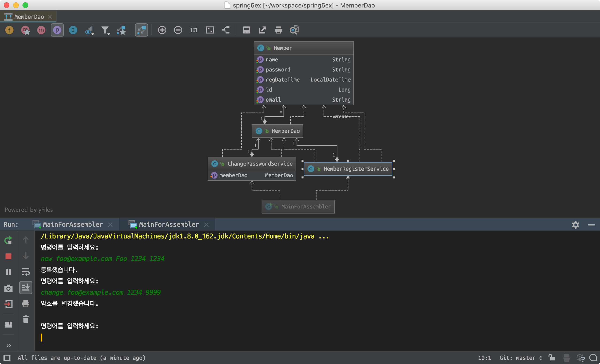
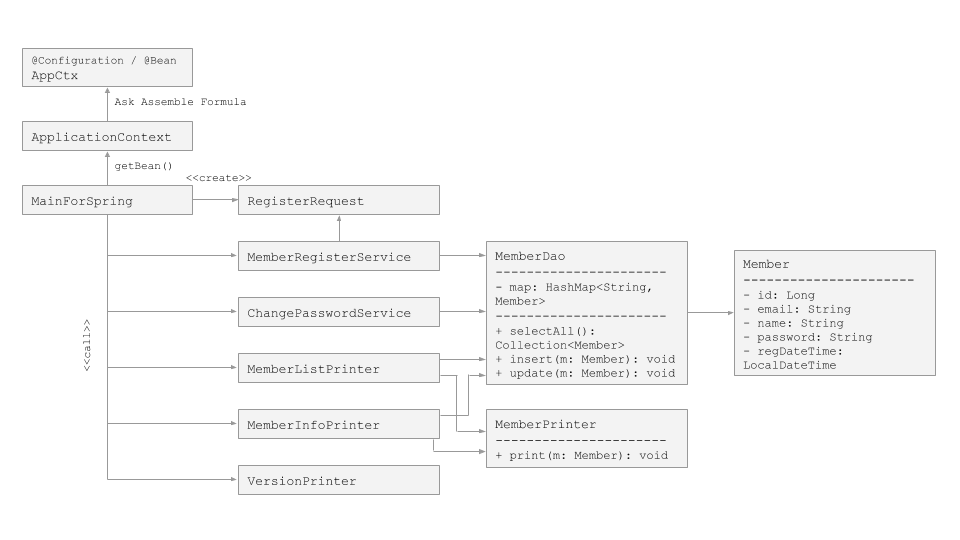

# 스프링 5 프레임웍 학습 프로젝트

초보 웹 개발자를 위한 스프링 5 프로그래밍 입문, 최범균 저

## ch 02 스프링 시작하기

#### mvn
```bash
$ mvn compile
```

#### gradle
```bash
$ gradle wrapper
$ gradle compileJava
```

#### Container & Bean
Role|Spring|Laravel
---|---|---
의존 역전 컨테이너|BeanFactory, ApplicationContext|ServiceContainer
객체 조립 공식 제공|Bean|ServiceProvider

**스프링의 Bean 제공 방법**
- `AnnotationConfigApplicationContext`
- `GenericXmlApplicationContext`
- `GenericGroovyApplicationContext`

#### 예제

```
+--------------------+
| AppContext         |
+--------------------+
| greeter(): Greeter |
+--------------------+
           ↑ 객체 조립 공식 요청
+--------------------+
| AnnotationConfig.. |
+--------------------+
    ↑ 객체 요청
+------+   call   +---------+
| Main | -------> | Greeter |
+------+          +---------+
```


---

## ch 03 스프링 DI
DI를 하는 이유는 변경의 유연함때문이다.

#### 조립기를 이용한 DI
- 조립기를 new up하면 하위 객체들도 모두 생성된다.
- 조립기를 사용해도 의존의 의존을 쉽게 교체할 수 있다.



#### 스프링 설정을 이용한 DI
- 설정용 클래스를 만들다 (e.g. `AppConf.java`).
- 클래스 선언에 `@Configuration` annotation을 붙여 설정임을 명시
- `@Configuration` 선언한 클래스의 각 메서드에 `@Bean` annotation을 붙여 Bean임을 명시
- 스프링 컨테이너를 new up하고 `getBean()` 함수를 호출하여 Bean으로 조립 공식을 명시했던 객체를 구한다.

```java
ApplicationContext ctx = new AnnotationConfigApplicationContext(AppConf.class);
Foo foo = ctx.getBean("foo", Foo.class);
// getBean(name: String, type: String)
```

- 생성자 주입 vs 세터(setter) 주입
- 스프링 컨테이너는 기본적으로 싱글톤으로 객체를 생성한다. `getBean()` 함수를 호출해 객체를 여러번 구하더라도 반환되는 객체는 호출할 때마다 다른 불변 객체가 아니라, 최초 한번 생성된 객체가 계속 반환된다.
- `@Autowired` annotation을 의존 주입 대상에 붙이면 스프링 설정 클래스(e.g. `AppConf.java`)의 `@Bean` 메서드에서 의존 주입을 하지 않아도 자동 주입됨
- 항상 스프링 DI, 즉 `@Bean`을 이용해서 의존 주입을 해야 하나? NO.


그림원본: https://docs.google.com/presentation/d/19irgFnDIMzhn34Q0n2BIusquKzra3VilYK9B-nqsaRQ/edit?usp=sharing

--- 

## ch04 의존 자동 주입

- 의존 자동 주입이란? `@Autowired`
- `@Autowired` 적용 가능 위치는? Field, Setter method
- 의존 자동 주입을 했는데, 일치하는 Bean이 선언되어 있지 않은 경우? `NoSuchBeanDefinitionException`
- Bean이 중복 선언되었고, 스프링이 하나를 선택할 수 없을 때? `NoUniqueBeanDefinitionException`
- 스프링에게 힌트 제공하기 `@Qualifier`
```java
@Configuration
public class AppCtx {
    @Bean
    @Qualifier("foo")
    public Foo foo() {}    
}

public class SomeService {
    @Autowired
    @Qualifier("foo")
    public void funcRequiresFoo() {}    
}
```
- `@Qualifier` 적용 가능 위치는? Field, Setter method
- 상속 그래프에 포함된 자식 객체일 때, 정확한 객체를 주입 받으려면?
    - `@Qualifier`를 이용해서 Bean 이름을 명시하거나
    - `@Autowired`선언된 필드 또는 함수의 매개 변수 타입을 하위 타입으로 명시
- 의존 자동 주입이 되지 않아도 작동하는 로직일 때는? 
    - `@Autowired(required = false)` 하거나
    - 필드 또는 매개 변수의 타입을 `Optional<Foo> foo`로 선언하거나
    - 필드 또는 매개 변수의 타입을 `@Nullable`로 선언
- `@Autowired(required = false)`는 Setter 함수가 호출되지 않는 반면, Optional, Nullable은 호출됨 유의
- 생성자에서 `@Autowired` 선언된 필드를 초기화했다면, 스프링이 의존 자동 주입을 다시 시도하므로 초기화된 필드값은 덮어써짐 유의

> 자동 주입을 하는 코드와 수동으로 주입하는 코드가 섞여 있으면 주입을 제대로 하지 않아서 `NullPointerException`이 발생했을 때 원인을 찾는데 오랜 시간이 걸릴 수 있다. 의존 자동 주입을 사용한다면 일관되게 사용해야 이런 문제가 줄어든다. 의존 자동 주입을 사용하고 있다면 일부 자동 주입을 적용하기 어려운 코드를 제외한 나머지 코드는 의존 자동 주입을 사용하자. 

---

## ch 05 컴포넌트 스캔

- 스프링이 직접 클래스를 검색해서 Bean으로 등록해 주는 기능
    - 자동 Bean 등록할 클래스 선언 바로 위에 `@Component` annotation 추가
    - 설정 클래스 선언 바로 위에 `@ComponentScan(basePackage = {"target package 1","target package 2"})` 추가
- 별칭을 부여하려면? `@Component("foo")`
- 별칭을 부여하지 않으면? 클래스 이름을 camelCase로 바꿔 Bean 이름으로 사용함. e.g. `class MemberDao` -> `memberDao`
- 스캔 대상에서 제외하려면?
```java
@Configuration
@ComponentScan(basePackage = {"foo"}, excludeFilters = @Filter(type = FilterType.REGEX, pattern = "foo\\..*Dao"))
public class AppCtx { }
```
- 다른 필터?
    - `excludeFilters = @Filter(type = FilterType.ASPECTJ, pattern = "foo.*Dao")`
    - `excludeFilters = @Filter(type = FilterType.ANNOTATION, classes = {NoProduct.class, ManualBean.class})`
    - `excludeFilters = @Filter(type = FilterType.ASSIGNABLE_TYPE, classes = MemberDao.class)` 자신 및 하위 타입 제외
- 다른 스캔 대상? `@Controller`, `@Service`, `@Repository`, `@Aspect`, `@Controller`
- Bean 이름 충돌?
    - 자동 스캔 과정에 충돌이 발생하면, 둘 중에 하나에 이름을 명시
    - 수동 등록한 Bean과 자동 스캔한 Bean 이름이 충돌하면, 수동 등록한 Bean 우선 사용

---

## ch 06 빈 라이프사이클과 범위
```
컨테이너 초기화                               컨테이너 종료
<------------------------------------>    <--------> 
+--------+    +--------+    +--------+    +--------+ 
| 객체생성 | -> | 의존설정 | -> |  초기화  | -> |  소멸   |  
+--------+    +--------+    +--------+    +--------+
```
```java
// 컨테이너 초기화
ApplicationContext ctx = new AnnotationConfigApplicationContext(AppCtx.class);
foo = ctx.getBean("foo", Foo.class);
// 컨테이너 종료
ctx.close();
```
- 컨테이너가 초기화되면 컨테이너를 사용할 수 있다. 컨테이너를 사용한다는 것은 `getBean()`가 같은 메서드를 이용해서 컨테이너에 보관된 Bean 객체를 구한다는 것을 뜻한다.
- Bean 객체의 생성과 소멸 시점에 추가적인 로직을 실행하고 싶다면, `InitializingBean`, `DisposableBean` 인터페이스를 구현한다. e.g. 데이터베이스 연결을 끊는다. 채팅을 위한 Tcp 커넥션을 끊는다.
```java
public class AClient implements InitializingBean, DisposableBean {
    @Override
    public void afterPropertiesSet() throws Exception {
        // Hook here...
    }
    
    @Override
    public void destroy() throws Exception {
        // Hook here...
    }
}
```
- 인터페이스를 구현하지 않고 커스텀 초기화 및 종료를 위한 메서드를 직접 정의하려면? `@Bean(initMethod = "..", destroyMethod = "..")`
```java
@Configuration
public class AppCtx {
    @Bean(initMethod = "connect", destroyMethod = "close")
    public ExClient client() {
        return new ExClient();
    }    
}
```
- Bean 객체의 라이프를 관리하려면? `@Scope("prototype")`
```java
@Configuration
public class AppCtx {
    @Bean
    @Scope("prototype")
    public AClient client() {
        return new AClient();
    }    
}
```
> `주의` 프로토타입 범위의 Bean은 컨테이너의 완전한 라이프사이클을 따르지 않으므로, 직접 소멸 처리해줘야 함.

---

## ch07 AOP 프로그래밍
- `pom.xml`에 `aspectjweaver` 의존 모듈 추가 필요
- AOP, Aspect Oriented Programming? 여러 객체에 공통으로 적용할 수 있는 기능을 분리해서 재사용성을 높여주는 프로그래밍 기법. 핵심 기능(비즈니스 로직)에 공통 기능(로깅, 보안, 캐싱 등)을 삽입하는 것이 요체.
- 기본 설정된 스프링에서는 "런타임에 프록시 객체를 생성해 공통 기능을 삽입하는 방법"만 제공
- Aspect? 공통 기능

용어|의미
---|---
Advice|"언제" 적용할 것인가? e.g. 메서드 호출전에
JoinPoint|Advice를 적용 가능한 지점. e.g. 메서드 호출
Pointcut|Advice가 적용되는 JoinPoint. 정규표현식 또는 AspectJ 문법 이용
Weaving|Advice를 적용하는 행위
Aspect|여러 객체에 적용되는 공통 기능. e.g. 트랜잭션 처리 등

- Advice의 종류?

종류|설명
---|---
Before|메서드 호출 전
After Returning|예외 없이 메서드 실행된 후
After Throwing|예외 발생했을 때
After|메서드 실행 후(like finally)
Around|메서드 실행 전, 후를 데코레이트

- 적용법
    - Aspect로 사용할 클래스에 `@Aspect` 선언
    - 공통 기능을 적용할 `@Pointcut` 선언
    - 공통 기능 구현 메서드에 `@Around` 선언
    - 스프링 설정 클래스에 `@EnableAspectJAutoProxy` 선언하고, Aspect를 Bean으로 등록
```java
@Aspect
public class ExeTimeAspect {
    @Pointcut("execution(public * package..factorial(..))") // 패턴에 맞는 메서드를 호출하면 데코레이트
    private void measureTarget() { }
    
    @Around("measureTarget()")
    public Object measure(ProceedingJoinPoint joinPoint) throws Throwable {
        try {
            Object result = joinPoint.proceed();
        } finally {
            Signature sig = joinPoint.getSignature();
            // sig.getName(); // e.g. factorial
            // joinPoint.getTarget().getClass().getSimpleName(); // e.g. RecCalculator  
            // Arrays.toString(joinPoint.getArgs()); // e.g. [5]
        }
    }
}

@Configuration
@EnableAspectJAutoProxy
public class AppCtx {
    @Bean
    public ExeTimeAspect exeTimeAspect() {
        return new ExeTimeAspect();
    }
}
```
- Main 함수에서 `@Pointcut` 패턴과 일치하는 객체의 함수(e.g. `RecCalculator#factorial()`)를 실행하면, Aspect가 작동함. 이때 객체의 타입은 `com.sun.proxy.$Proxy17`과 같은 임시 생성 타입임. 즉, 런타임에 `Calculator`를 구현한 `$Proxy17` 객체를 생성하고 `RecCalculator`를 랩핑한 것임.
```
+---------------+       +---------------+
| <<interface>> | <|--- | RecCalculator |
| Calculator    |       +---------------+
+---------------+       +---------------+
| + factorial() | <|--- | $Proxy17      |
+---------------+       +---------------+
```
- 인터페이스를 사용하지 않으려면? `@EnableAspectAutoProxy(proxyTargetClass = true)`
```java
@Configuration
@EnableAspectAutoProxy(proxyTargetClass = true)
public class AppCtx { }
```
- `@Pointcut("execution(???)")` 용법
    - `*` 와일드 카드 e.g. `set*`, `get*(*, *)`
    - `..` 0개 이상 e.g. `root..*` root 패키지 및 하위의 모든 패키지
```
execution({visibility} {return type} {class name pattern} {method name pattern}(param pattern))
```
- Advice 적용 순서? `@Order(Integer)` 선언
```java
@Aspect
@Order(1)
public class FooAspect {}

@Aspect
@Order(2)
public class BarAspect {}
```
- `@Around`에 execution 표현식을 직접 선언할 수도 있음. e.g. `@Around("execution(public * root..*(..))")`
- `@Pointcut` 재사용
```java
public class CommonPointcut {
    @Pointcut("execution(public * root..*(..))")
    public void commonTarget() { }
}

@Aspect
public class FooAspect {
    @Around("CommonPointcut.commonTarget()")
    public Object execute(ProceedingJoinPoint joinPoint) throws Throwable { }
}
```

---

## ch 08 DB 연동
- `pom.xml`에 `spring-jdbc`, `tomcat-jdbc`, `mysql-connector-java` 의존 모듈 추가 필요
- 회원 테이블 생성
```sql
CREATE USER 'spring5ex'@'localhost' IDENTIFIED BY 'secret';
CREATE DATABASE spring5ex CHARACTER SET=utf8;
GRANT PRIVILEGES ON spring5ex.* TO 'spring5ex'@'localhost';

CREATE TABLE spring5ex.members (
    id AUTO_INCREMENT PRIMARY KEY,
    email VARCHAR(255),
    password VARCHAR(100),
    name VARCHAR(100),
    regdate datetime,
    UNIQUE KEY (email)
) ENGINE=InnoDB CHARACTER SET=utf8;

INSERT INTO member (email, password, name, regdate) VALUES ('foo@bar.com', '1234', 'Foo', NOW());
```
- 스프링이 제공하는 DB 연동 기능은 DataSource를 사용해서 DB Connection을 구한다. DB 연동에 사용할 DataSource를 스프링 Bean으로 등록하고 DB 연동 기능을 구현한 Bean 객체는 DataSource를 주입 받아서 사용한다
```java
@Configuration
public class AppCtx {
    @Bean(destroyMethod = "close")
    public DataSource dataSource() {
        DataSource ds = new DataSource();
        ds.setDriverClassName("com.mysql.jdbc.Driver");
        ds.setUrl("jdbs:mysql://localhost/spring5ex?characterEncoding=utf8");
        ds.setUsername("spring5ex");
        ds.setPassword("secret");
        ds.setInitialSize(2); // 커넥션 풀의 커넥션 개수
        ds.setMaxActive(10); // 커넥션 풀의 최대 커넥션 개수
        return ds;
    }

    @Bean
    public MemberDao memberDao() {
        return new MemberDao(dataSource());
    }
}
```
- 커넥션 풀에 커넥션을 요청하면 해당 커넥션은 활성(active) 상태가 되고, 커넥션을 다시 커넥션 풀에 반환하면 유휴(idle) 상태가 된다.
- `maxActive`를 10으로 지정하면 이는 커넥션 풀이 수용할 수 있는 동시 DB 커넥션이 10개라는 뜻이다. 현재 활성 커넥션이 10개인데 다시 커넥션을 요청하면 다른 커넥션이 반환될 때까지 대기한다. 이 대기 시간이 `maxWait`다. 대기 시간 내에 풀에 반환된 커넥션이 있으면 해당 커넥션을 구하게 되고, 대기 시간 내에 반환된 커넥션이 없으면 예외가 발생한다.

#### 목록 조회 쿼리
- `List<T> query(String sql, RowMapper<T> rowMapper)`
- `List<T> query(String sql, Object[] args, RowMapper<T> rowMapper)`
- `List<T> query(String sql, RowMapper<T> rowMapper, Object ...args)`

```java
public class MemberDao {
    private static final String QUERY_SELECT_BY_EMAIL = "SELECT * FROM members WHERE email = ?";
    private JdbcTemplate jdbcTemplate;

    public MemberDao(DataSource dataSource) {
        this.jdbcTemplate = new JdbcTemplate(dataSource);
    }

    public Member selectByEmail(String email) {
        List<Member> results = jdbcTemplate.query(QUERY_SELECT_BY_EMAIL, new RowMapper<Member>() {
            @Override
            public Member mapRow(ResultSet rs, int rowNum) throws SQLException {
                Member member = new Member(
                    rs.getString("email"),
                    rs.getString("password"),
                    rs.getString("name"),
                    rs.getTimestamp("regdate").toLocalDateTime()
                );
                member.setId(rs.getLong("id"));
                return member;
            }
        }, email);

        return results.isEmpty() ? null : results.get(0);
    }
}
```

#### 단일 행 조회 쿼리
- `T queryForObject(String sql, Class<T> requiredType)`
- `T queryForObject(String sql, Class<T> requiredType, Object ...args)`
- `T queryForObject(String sql, RowMapper<T> rowMapper)`
- `T queryForObject(String sql, RowMapper<T> rowMapper, Object ...args)`
```java
private static final String QUERY_COUNT = "SELECT COUNT(*) FROM members";

public int count() {
    Integer count = jdbcTemplate.queryForObject(QUERY_COUNT, Integer.class);
    return count;
}
```
- `queryForObject()` 메서드를 사용하려면 쿼리 실행 결과는 반드시 한 행이어야 한다. 만약 쿼리 실행 결과 행이 없거나 두 개 이상이면 `IncorrectRequltSizeDataAccessException`이 발생한다. 행의 개수가 0이면 하위 클래스인 `EmptyResultDataAccessException`이 발생한다. 따라서 결과 행이 정확하게 한 개가 아니면 `queryForMethod()` 메서드 대신 `query()` 메서드를 사용해야 한다.

#### 변경 쿼리
- `int update(String sql)`
- `int update(String sql, Object ...args)`
```java
private static final String QUERY_UPDATE = "UPDATE members SET name = ?, password = ? WHERE email = ?";

public void update(Member member) {
    jdbcTemplate.update(QUERY_UPDATE, member.getName(), member.getPassword(), member.getEmail());
}
```

#### PreparedStatement 사용
- `List<T> query(PreparedStatementCreator psc, RowMapper<T> rowMapper)`
- `int update(PreparedStatementCreator psc)`
- `PreparedStatementCreator`를 구현한 클래스는 `createPreparedStatement()` 메서드의 파라미터로 전달받는 `Connection`을 이용해서 `PreparedStatement` 객체를 생성하고 인덱스 파라미터를 알맞게 설정한 뒤에 리턴하면 된다.
```java
private static final String QUERY_INSERT = "INSERT INTO members (email, password, name, regdate) VALUES (?, ?, ?, ?)";

public void insert(final Member member) {
    jdbcTemplate.update(new PreparedStetementCreator() {
        @Override
        public PreparedStatement createPreparedStatement(Connection con) throws SQLException {
            PreparedStatement pstmt = con.parepareStatement(QUERY_INSERT);
            pstmt.setString(1, member.getEmail());
            pstmt.setString(2, member.getPassword());
            pstmt.setString(3, member.getName());
            pstmt.setTimestamp(4, Timestamp.valueOf(member.getRegisterDateTime()));
            return psmt;
        }
    });
}
```

#### 자동 생성 키 값 구하기
- `int update(PreparedStatementCreator psc, KeyHolder generatedKeyHolder)`
```java
private static final String QUERY_INSERT = "INSERT INTO members (email, password, name, regdate) VALUES (?, ?, ?, ?)";

public void insert(final Member member) {
    KeyHolder = keyHolder = new GeneratedKeyHolder();
    jdbcTemplate.update(new PreparedStetementCreator() {
        @Override
        public PreparedStatement createPreparedStatement(Connection con) throws SQLException {
            PreparedStatement pstmt = con.parepareStatement(QUERY_INSERT, new String[]{"id"});
            pstmt.setString(1, member.getEmail());
            pstmt.setString(2, member.getPassword());
            pstmt.setString(3, member.getName());
            pstmt.setTimestamp(4, Timestamp.valueOf(member.getRegisterDateTime()));
            return psmt;
        }
    }, keyHolder);
    Number keyValue = keyHolder.getKey();
    member.setId(keyValue.longValue());
}
```

#### 예외 번역
> `convertSqlToDataException()` 함수를 찾을 수 없음;;;

- `RuntimeException` <- `DataAccessException` <- `BadSqlGrammerException`, `DuplicateKeyException`, `QueryTimeoutException`
```java
try {
    // JDBC 코드
} catch (SQLException e) {
    throw convertSqlToDataException(e);
}
```

#### 트랜잭션 처리
- 트랜잭션 범위에서 실행할 함수 위에 `@Transactional` 선언 & 스프링 설정 클래스에 `@PlatformTransactionManager` Bean 설정
```java
@Configuration
@EnableTransactionManagement
public class AppCtx {
    @Bean
    public PlatformTransactionManager transactionManager() {
        DataSourceTransactionManager tm = new DataSourceTransactionManager();
        tm.setDataSource(dataSource());
        return tm;
    }
}

public class ChangePasswordService {
    @Transactional
    public void changePassword(String email, String oldPwd, String new Pwd) {
        // ...
    }
}
```
- 스프링은 `@Transactional` annotation을 이용해서 트랜잭션을 처리하기 위해서 내부적으로 AOP를 사용한다.
- 별도 설정을 추가하지 않으면 `RuntimeException`이 발생하면 트랜잭션을 롤백한다.

#### 로깅 활성화
- `pom.xml`에 `slf4j-api`, `logback-classic` 의존 모듈 추가 필요
- `logback.xml` 추가 필요

---

## ch 09 스프링 MVC 시작하기
- 스프링 웹 MVC 프로젝트 폴더 구조
```
.
├── pom.xml
└── src/main
    ├── java
    │   ├── HelloController.java
    │   └── config
    │       ├── MvcConfig.java
    │       └── ControllerConfig.java
    └── webapp
        └── WEB-INF
            ├── web.xml
            └── view
                └── hello.jsp
```

#### 설정
- `pom.xml`
    - `<packaging>war</packaging>`
    - javax.servlet-api 모듈
    - javax.servlet.jsp-api 모듈
    - jstl 모듈
    - spring-mvc 모듈
- 로컬 테스트를 위해 톰캣 또는 제티 서버 필요
- 스프링 컨테이너 설정
```java
@Configuration
@EnableWebMvc
public class MvcConfig implements WebMvcConfigurer {
    @Override
    public void configureDefaultServletHandling(DefaultServletHandlerConfigurer configurer) {
        configurer.enable();
    }

    @Override
    public void configureViewResolvers(ViewResolverRegistry registry) {
        retistry.jsp("/WEB-INF/view/", ".jsp");
    }
}
```
- `web.xml`
    - `DispatcherServlet` 별칭 등록
    - 스프링 설정 클래스의 타입 등록(`AnnotationConfigWebApplicationContext`)
    - 스프링 설정 경로 등록
    - 웹 요청을 등록한 `DispatcherServlet`이 처리하도록 맵핑 추가
    - 요청 파라미터 인코딩 관련 서블릿 필터 등록

#### tomcat 설정
```bash
$ brew install tomcat

$ which catalina
# /usr/local/bin/catalina

$ catalina version
# Using CATALINA_BASE:   /usr/local/Cellar/tomcat/9.0.13/libexec
# Using CATALINA_HOME:   /usr/local/Cellar/tomcat/9.0.13/libexec
# ...
```


#### 컨트롤러 구현
```java
@Controller
public class HelloController {
    @GetMapping("/hello")
    public String hello(Model model, @RequestParam(value = "foo", required = false) String foo) {
        // model은 Request 객체이며, 아래 코드에서 greeting이란 속성을 동적으로 추가함.
        model.addAttribute("greeting", "Hello " + foo);
    }

    // hello는 뷰 이름. /src/main/webapp/WEB-INF/view/hello.jsp
    return "hello"; 
}
```
- 컨텍스트 경로(`pom.xml` `<artifactId>here</artifactId>`)를 시작 위치로 URL 결정됨. 위 예제의 경우 `GET /here/hello`가 URL임.
- 컨트롤러 Bean 등록
```java
// src/main/java/config/ControllerConfig.java
@Configuration
public class ControllerConfig {
    @Bean
    public HelloController helloController() {
        return new HelloController();
    }
}
```

#### 뷰
```html
<%@ page contentTYpe="text/html; charset=utf-8"%>
<!DOCTYPE html>
...
${greeting} <!-- // JSP Expression Language -->
```

#### 실행하기


---

## ch 10 스프링 MVC 프레임워크 동작 방식
- 스프링 MVC의 핵심 구성 요소. = 박스된 2개는 개발자가 직접 구현해야 함
```
+--------+    +-------------------+ 
| Client |    | DispatcherServlet | 
+--------+    +-------------------+ 
    | 1. Web Request    |
    | ----------------> | 2. find matching 
    |                   |    controller     +-----------------+ 
    |                   | ----------------> | <<spring bean>> | 
    |                   |                   | HandlerMapping  |
    |                   |                   +-----------------+
    |                   |                  
    |                   | 3. delegate req   +-----------------+ 4. exec           +=================+
    |                   | ----------------> | <<spring bean>> | ----------------> | <<spring bean>> |
    |                   | <---------------- | HandlerAdapter  | <---------------- | Controller      |
    |                   | 6. ModelAndView   +-----------------+ 5. return         +=================+
    |                   |                   
    |                   | 7. find View      +-----------------+
    |                   | ----------------> | <<spring bean>> |
    |                   | <---------------- | ViewResolver    |
    |                   | 8. View           +-----------------+
    |                   |
    |                   | 9. Make Response  +=================+
    |                   | ----------------> | JSP             |
    | 10. Web Response  |                   +=================+
    | <---------------- |
```

- `DispatcherServlet`은 스프링 컨테이너를 생성하고, 그 컨테이너로부터 필요한 Bean 객체를 구함
```
+-------------------+ <<create>>  +-------------------------+
| DispatcherServlet | ----------> | Spring Container        |
+-------------------+             | (WebApplicationContext) |
          |                       | +---------------------+ |
          |                       | | HandlerMapping      | |
          |                       | +---------------------+ |
          |                       | +---------------------+ |
          | <<use>>               | | HandlerAdapter      | |
          +---------------------> | +---------------------+ |
                                  | +---------------------+ |
                                  | | Controller Bean     | |
                                  | +---------------------+ |
                                  | +---------------------+ |
                                  | | ViewResolver        | |
                                  | +---------------------+ |
                                  +-------------------------+
```

#### DefaultHandler와 HandlerMapping의 우선 순위
- `@EnableWebMvc` 선언은 `RequestMappingHandlerMapping` Bean을 등록하며, `@Controller`, `@GetMapping("/foo")`로 정의한 컨트롤러 함수를 찾아서 웹 요청을 처리함
- ch09의 설정에 따라 `.jsp`를 제외한 모든 요청, 예를 들어 `/index.html`이나 `/css/bootstrap.css`도 `DispatcherServlet`이 처리함.
- 예로 든 정적 파일과 같이 경로와 컨트롤러간의 맵핑이 선언되지 않은 경우에는 `DefaultServletHandlerConfigurer#enable()`가 제공하는 두개의 Bean 객체를 통하여 웹 요청을 처리함
    - `DefaultServletHttpRequestHandler`
    - `SimpleUrlHandlerMapping`

다시 정리하면,

① `RequestMappingHandlerMapping`을 사용해서 요청을 처리할 핸들러를 검색한다.
  - 존재하면 해당 컨트롤러를 이용해서 요청을 처리한다.

② 존재하지 않으면 `SimpleUrlHandlerMapping`을 사용해서 요청을 처리할 핸들러를 검색한다.
  - `DefaultServletHandlerConfigurer#enable()` 메서드가 등록한 `SimpleUrlHandlerMapping`은 "/**" 경로(즉 모든 경로)에 대해 `DefaultServletHttpRequestHandler`를 리턴한다.
  - `DispatcherServlet`은 `DefaultServletHttpRequestHandler`에 처리를 요청한다.
  - `DefaultServletHttpRequestHandler`는 디폴트 서블릿에 처리를 위임한다.

---

## ch11 MVC1: 요청 매핑, 커맨드 객체, 리다이렉트, 폼 태그, 모델

> 대부분의 설정은 개발 초기에 완성된다. 따라서, 웹 애플리케이션을 개발한다는 것은 어떤 **1) 컨트롤러**를 이용해서 어떤 요청 경로를 처리할지 결정하고, 웹 브라우저가 전송한 요청에서 필요한 값을 구하고, 처리 결과를 **2) 뷰(JSP)**를 이용해서 보여주는 것이다.

- 웹 애플리케이션 개발은 다음 코드를 작성하는 일
    - 특정 요청 URL을 처리할 코드
    - 처리 결과를 HTML과 같은 형식으로 응답하는 코드
- 요청 매핑 annotation? 요청한 Url을 처리할 컨트롤러 함수를 매핑함
    - `@RequestMapping("/foo")`
    - `@GetMapping("/foo")`
    - `@PostMapping("/foo")`
    - `@PutMapping("/foo")`
    - `@PatchMapping("/foo")`
    - `@DeleteMapping("/foo")`
- 요청 파라미터 접근? 
    - `HttpServletRequest` 객체에 직접 접근하는 방식
    - `@RequestParam` annotation을 이용하는 방식

```java
@Controller
public class RegisterController {
    @PostMapping("/foo")
    public String someFunc(HttpServletRequest request) {
        String param = request.getParameter("param");
        // ...
    }
}
```
```java
@Controller
public class RegisterClass {
    @PostMapping("/foo")
    public String someFunc(@RequestParam(value = "param", required = false, defaultValue = "false") Boolean param) {
        if (param == false) { }
        // ...
    }
}
```
- 리다이렉트? `redirect:/path`
```java
@GetMapping("/foo2")
public String foo2Func() {
    return "redirect:/foo1"
}
```
- 커맨드 객체를 이용하여 요청 매핑? 컨트롤러 함수의 파라미터로 DTO 객체를 선언하면(HTTP 요청과 DTO의 필드명이 일치해야 함), `HttpServletRequest#getParameter()` 함수를 이용하여 DTO를 셋팅하지 않아도 됨.
```java
private FooService fooSvc;

@PostMapping("/foo")
public String fooFunc(FooRequest fooReq) {
    fooSvc.someFunc(fooReq);
    // ...
}
```
```html
<p>${fooReq.property}</p>
```
- 커맨드 객체와 스프링 폼 연동
```html
<input type="text" name="property" value="${fooReq.property}">
```
- 컨트롤러 구현이 없는 경로 매핑
```java
@Configuration
@EnableWebMvc
public class MvcConfig implements WebMvcConfigurer {
    @Override
    public void addViewControllers(ViewControllerRegistry registry) {
        registry.addViewController("/main").setViewName("main");
    }
}
```
- Model 객체를 통해 컨트롤러에서 뷰에 데이터 전달하기
```java
@Controller
public class SurveyController {
    @GetMapping("/survey")
    public String form(Model model) {
        List<Question> questions = createQuestions();
        model.addAttribute("questions", questions);
        return "survey";
    }
}
```
```html
<!-- // survry.jsp -->
<c:forEach var="q" items="${questions}" varStatus="status">
</c:forEach>
```
- ModelAndView 객체 이용
```java
@Controller
public class SurveyController {
    @GetMapping("/survey")
    public ModelAndView form() {
        List<Question> questions = createQuestions();
        ModelAndView = mav = new ModelAndView();
        mav.addObject("questions", questions);
        mav.setViewName("survey");
        return mav;
    }
}
```

---

## ch 12 MVC2: 메시지, 커맨드 객체 검증
### 메시지
- 적용법
    - 문자열을 담을 파일을 준비한다.
    - 메시지 파일에서 값을 읽어오는 `MessageSource` Bean 을 설정한다.
    - JSP 코드에서 `<spring:message>` 태크를 이용해서 메시지를 출력한다.
```bash
# src/main/resources/message/label.properties
email=이메일
password.confirm=비밀번호 확인
register.done=<strong>{0}님</strong>, 환영합니다.
```
```java
@Configuration
@EnableWebMvc
public class MvcConfig implements WebMvcConfigurer {
    @Bean
    public class MessageSource messageSource() {
        ResourceBundleMessageSource ms = new ResourceBundleMessageSource();
        ms.setBasenames("message.label");
        ms.setDefaultEncoding("UTF-8");
        return ms;
    }
}
```
```html
<%@ taglib prefix="spring" uri="http://www.springframework.org/tags" %>
<label><spring:message code="email" /></label>
<p><spring:message code="register.done" arguments="${registerRequest.name}" /></p>
```

### 커맨드 객체 유효성 검증
#### `Validator#validate()` 함수를 호출하는 방법
- 적용법
    - `Validator` 클래스를 구현한다.
    - 컨트롤러에서 `Validator#validate()` 함수를 호출한다.
    - 메시지 파일에 에러코드에 따라 출력할 문자열을 정의한다.
    - JSP 코드에서 `<form:errors>` 태크를 이용해서 메시지를 출력한다.
```java
public class RegisterRequestValidator implements Validator {
    @Override
    public boolean supports(Class<?> aClass) {
        // aClass 객체가 RegisterRequest 타입으로 변환 가능한지 확인
        return RegisterRequest.class.isAssignableFrom(aClass);
    }

    @Override
    public void validate(Object o, Errors errors) {
        RegisterRequest regReq =. (RegisterRequest) o;
        if (regReq.getEmail() == null) {
            errors.rejectValue("email", "required");
        }
        ValidationUtils.rejectIfEmptyOrWhitespace(errors, "name", "required");
        ValidationUtils.rejectIfEmpty(errors, "password", "required");
    }
}
```
```java
@Controller
public class RegisterController {
    @PostMapping(..)
    pulbic String register(RegisterRequest regReq, Errors errors) {
        (new RegisterRequestValidator()).validate(regReq, errors);
        if (errors.hasError()) {
            // return or throw
        }
    }
}
```
```bash
# src/main/resources/message/label.properties
required=필수 항목입니다.
required.name=이름은 필수 항목입니다.
```
```html
<%@ taglib prefix="form" uri=""http://www.springframework.org/tags/form %>
<%@ taglib prefix="spring" uri=""http://www.springframework.org/tags %>
<form:form>
<form:input path="email" />
<form:errors path="email" />
</form:form>
```
- `Errors`
    - `reject(String errorCode, Object[] errorArgs, String defaultMessage)` // 커맨드 객체 자체가 유효하지 않을 때
    - `rejectValue(String field, String errorCode, Object[] errorArgs, String defaultMessage)`
- `ValidationUtils`
    - `rejectIfEmpty(Errors errors, String field, String errorCode, Object[] errorArgs)`
    - `rejectIfEmptyOrWhitespace(Errors errors, String field, String errorCode, Object[] errorArgs)`
- 에러 메시지 적용 우선 순위
    - `required.registerRequest.email`
    - `required.email`
    - `required.String`
    - `required`

#### 전역 범위 Validator를 이용하는 방법
- 적용법
    - 설정 클래스에서 `WebMvcConfigurer#getValidator()` 메서드가 `Validator` 구현 객체를 리턴하도록 구현
    - 전역 범위 `Validator`가 검증할 커맨드 객체에 `@Valid` annotation 적용
```java
@Configuration
@EnableWebMvc
public class MvcConfig implements WebMvcConfigurer {
    @Override
    public Validator getValidator() {
        return new RegisterRequestValidator();
    }
}
```
```java
@Controller
public class RegisterController {
    @PostMapping(..)
    public String register(@Valid RegisterRequest regReq, Errors errors) {
        // Validator.validate() 함수 호출하지 않음
        if (errors.hasError()) {
            // return or throw
        }
    }
}
```

#### Bean Validation을 이용하는 방법
- 적용법
    - 의존 모듈 추가
    - 커맨드 클래스에 검증 annotation 추가
    - 검증할 커맨드 객체에 `@Valid` annotation 적용
    - (선택) 메시지 파일에 에러코드에 따라 출력할 커스텀 문자열을 정의한다.
- `주의` Bean Validation을 이용할 때는 `WebMvcConfigurer#getValidator()`를 Override하면 안됨. 왜냐하면, `@EnableWebMvc` annotation이 `OptionalValidatorFactoryBean`을 전역 Validator로 자동 등록하므로.
```xml
<dependency>
  <groupId>javax.validation</groupId>
  <artifactId>validation-api</artifactId>
  <version>1.1.0.Final</version>
</dependency>

<dependency>
  <groupId>org.hibernate</groupId>
  <artifactId>hibernate-validator</artifactId>
  <version>5.4.2.Final</version>
</dependency>
```
```java
public class RegisterRequest {
    @NotBlank
    @Email
    private String email;
    @Size(min = 6)
    private String password;
}
```
```java
@Controller
public class RegisterController {
    @PostMapping(..)
    public String register(@Valid RegisterRequest regReq, Errors errors) {
        // Validator.validate() 함수 호출하지 않음
        if (errors.hasError()) {
            // return or throw
        }
    }
}
```
```bash
NotBlank=필수 항목입니다. 공백 문자는 허용하지 않습니다.
Email=올바른 이메일 주소를 입력해야 합니다.
Size.password=암호 길이는 6자 이상이어야 합니다.
```
- 에러 메시지 적용 우선 순위
    - `NotBlank.registerRequest.email`
    - `NotBlank.email`
    - `NotBlank`
- Bean Validation의 주요 annotation? `@AssertTrue`, `@AssertFalse`, `@DecimalMax`, `@DecimalMin`, `@Max`, `@Min`, `@Digits`, `@Size`, `@Null`, `@NotNull`, `@Pattern`
- `주의` `NotNull`을 제외한 나머지 annotation은 검사 대상 값이 null이면 유효한 것으로 판단함
- `참고` Bean Validation 2.0

---

## ch13 MVC3: 세션, 인터셉터, 쿠키
#### 세션
- 사용법 두 가지
    - 요청 매핑을 적용한 컨트롤러 메서드에 `HttpSession` 파라미터를 추가한다.
    - 요청 매핑을 적용한 컨트롤러 메서드에 `HttpServletRequest` 파라미터를 추가하고, `HttpServletRequest#getSession()` 함수를 이용한다.
    - 첫 번째 방법은 항상 `HttpSession`을 사용하지만 두 번째 방법은 `getSession()`함수를 호출했을 때만 `HttpSession` 객체를 생성한다.
```java
@PostMapping
public String form(LoginCommand loginCommand, Errors errors, HttpSession session) { }
```
```java
@PostMapping
public String foo(LoginCommand loginCommnad, Errors errors, HttpServletRequest req) {
    HttpSession session = req.getSession();
    session.setAttribute("foo", foo); // 세션 데이터 저장
    Foo foo = (Foo) session.getAttribute("foo"); // 세션 데이터 조회
    session.invalidate(); // 세션 삭제
}
```

#### 인터셉터
프레임워크|기능
---|---
Spring|`Interceptor`, `HandlerInterceptor`
Laravel|`Middleware`, `HttpMiddleware`

호출 시점|Spring|Laravel
---|---|---
컨트롤러(핸들러) 실행 전|`preHandle`|Before Middleware
컨트롤러(핸들러) 실행 후, 뷰 렌더링 전|`postHandle`|After Middleware
뷰를 실행한 후|`afterCompletion`|Terminable Middleware

- 적용법
    - `HanlderInterceptor`를 구현한 인터셉터 클래스 구현
    - 스프링 설정 파일에 `WebMvcConfigurer#addInterceptors()` 재정의한 함수 구현
```java
public class AuthCheckInterceptor implements HandlerInterceptor {
    @Override
    public boolean preHandle(HttpServletRequest req, HttpServletResponse resp, Object handler) throes Exception {
        resp.sendRedirect(req.getContextPath() + "/login"); // 로그인 페이지로 돌려보내는 예
        // 검사 로직 수행 및 Boolean 반환
    }
}
```
```java
@Configuration
@EnableWebMvc
public class MvcConfig implements WebMvcConfigurer {
    @Bean
    public AuthCheckInterceptor authCheckInterceptor() {
        return new AuthCheckInterceptor();
    }

    @Override
    public void addInterceptors(InterceptorRegistry registry) {
        registry.addInterceptor(authCheckInterceptor())
            .addPathPatterns("/edit/**")
            // 제외할 Ant 패턴 추가
            .excludePathPatterns("/edit/help/**");
    }
}
```
- `HandlerInterceptor` 인터페이스
    - `boolean preHandle(HttpServletRequest req, HttpServletResponse resp, Object handler) throws Exception`
    - `void postHandle(HttpServletRequest req, HttpServletResponse resp, Object handler, ModelAndView mav) throws Exception`
    - `void afterCompletion(HttpServletRequest req, HttpServletResponse resp, Object handler, Exception e) throws Exception`

#### 쿠키
- 사용법? 
    - 요청 매핑을 적용한 컨트롤러 메서드에 `@CookieValue` annotation 파라미터 적용하여 `Cookie` 객체를 구하여 쿠키 값에 접근할 수 있음
    - `HttpServletResponse#addCookie()` 메서드를 이용해서 응답 헤더에 쿠키를 내보낼 수 있음
```java
@Controller
@RequestMapping("/login")
public class LoginController {
    @GetMapping
    public String form(LoginCommand loginCommand,
                       @CookieValue(value = "REMEMBER", required = false) Cookie rCookie) {
        if (rCookie != null) {
            // 커맨드 객체에 쿠키에서 읽은 값을 셋팅해서 뷰 렌더링
            loginCommand.setEmail(rCookie.getValue());
            loginCommand.setRememberEmail(true);
        }
        return "login/loginForm";
    }

    @PostMapping
    public String submit(LoginCommand loginCommand, Errors errors, HttpSession session, HttpServletResponse response) {
        Cookie rememberCookie = new Cookie("REMEMBER", loginCommand.getEmail());
        rememberCookie.setPath("/");
        // Set-Cookie 응답 헤더 전송
        rememberCookie.setMaxAge(60 * 60 * 24 * 30); // 30 days
        response.addCookie(rememberCookie);
        return "login/loginSuccess";
    }
}
```

---
