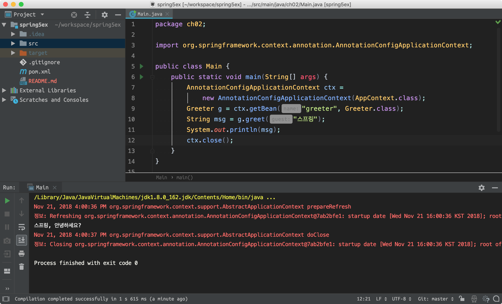

# 스프링 학습 프로젝트

초보 웹 개발자를 위한 스프링 5 프로그래밍 입문, 최범균 저

## ch 02 스프링 시작하기

#### mvn
```bash
$ mvn compile
```

#### gradle
```bash
$ gradle wrapper
$ gradle compileJava
```

#### Container & Bean
Role|Spring|Laravel
---|---|---
의존 역전 컨테이너|BeanFactory, ApplicationContext|ServiceContainer
객체 조립 공식 제공|Bean|ServiceProvider

**스프링의 Bean 제공 방법**
- `AnnotationConfigApplicationContext`
- `GenericXmlApplicationContext`
- `GenericGroovyApplicationContext`

#### 예제

```
+--------------------+
| AppContext         |
+--------------------+
| greeter(): Greeter |
+--------------------+
           ↑ 객체 조립 공식 요청
+--------------------+
| AnnotationConfig.. |
+--------------------+
    ↑ 객체 요청
+------+   call   +---------+
| Main | -------> | Greeter |
+------+          +---------+
```



---

## ch 03 스프링 DI
DI를 하는 이유는 변경의 유연함때문이다.

#### 조립기를 이용한 DI
- 조립기를 new up하면 하위 객체들도 모두 생성된다.
- 조립기를 사용해도 의존의 의존을 쉽게 교체할 수 있다.


